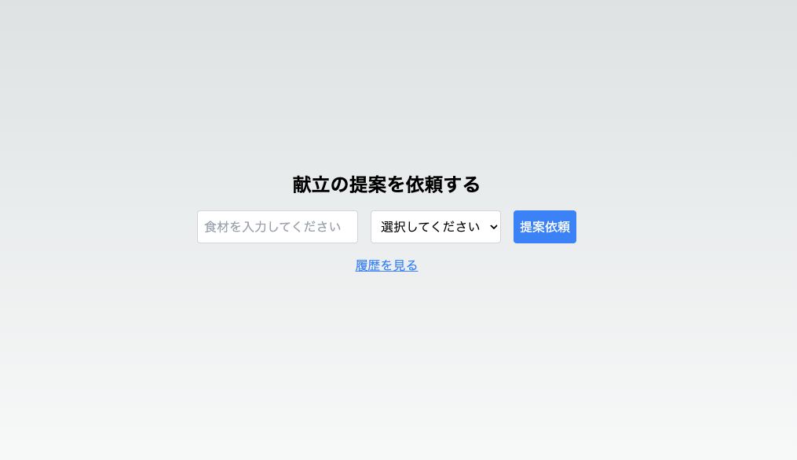
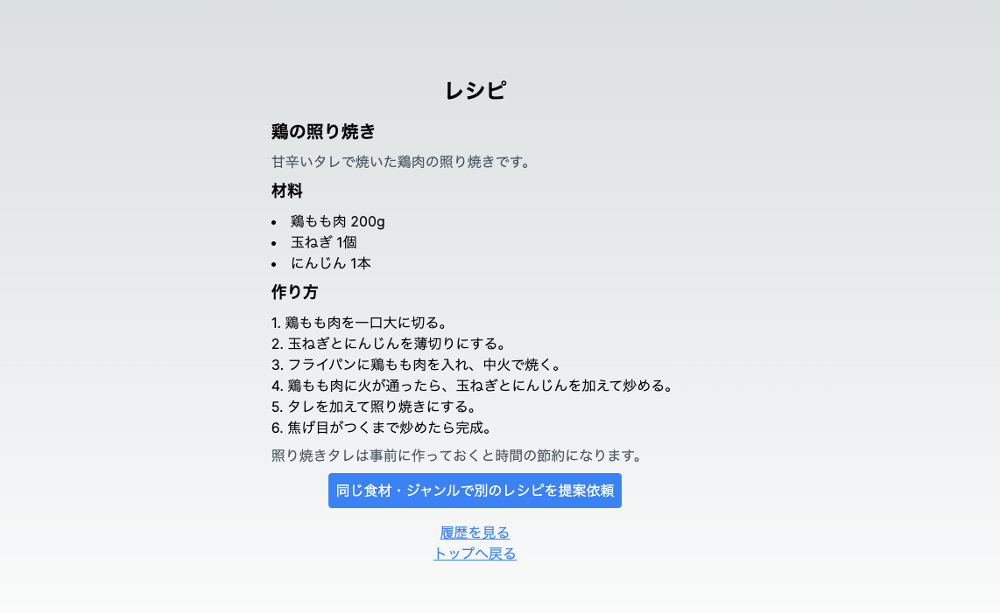

# 概要

【WIP 入力通りに提案してくれません。笑】
Next.js と OpenAI の API を利用した献立提案システム

# 事前準備

1. リポジトリのクローン
2. ライブラリのインストール
   1. `npm i`
3. DB 用の json ファイルを作成
   1. プロジェクト（kondate）直下で以下のコマンドを実行
   2. `cp src/json/example_data.json src/json/data.json`
4. .env ファイルを作成
   1. プロジェクト（kondate）直下で以下のコマンドを実行
   2. `touch .env.local`
5. .env ファイルに OpenAI の"API keys"を記述
   1. "API keys"を発行していない場合は発行（[OpenAI API keys](https://platform.openai.com/account/api-keys)）
      1. **注意** : OpenAI の API は有料です。高額請求が発生した場合も責任は負えません。自己責任でご利用下さい。
   2. `OPENAI_API_KEY=sk-xxxxxxxxxxxxxxxxxxxx`
6. サーバー起動
   1. プロジェクト（kondate）直下で以下のコマンドを実行
   2. `npm run dev`

# 使い方

1. 食材の入力、ジャンルの選択をして"提案依頼"ボタンをクリック
   
2. 入力内容からおすすめのレシピを生成して提案してくれます
   
